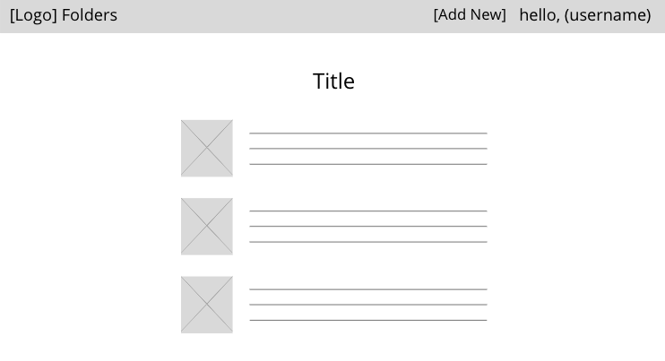
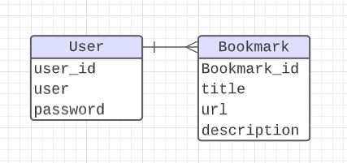

## Bookmark 

### 🔖 About the project 

Bookmark allows users to organize and save web content during their learning journey

### 📌 Project Requirements 
- A working full-stack, single-page application hosted on Heroku 
- Incorporate the technologies of the MERN-stack
- Implement token-based authentication (ability of a user to sign-up, log in & log out)
- Implement authorization by restricting CUD data functionality to authenticated users. (navigation should respond to the login status of the user)
- well-scoped feature-set
  - Consume data from a third-party API
  - Implement additional functionality if the user is an admin

### 🖥️ Technologies used 
- MongoDB/Mongoose 
- Express (backend via AJAX)
- React
- Node

### 🔎 Getting Started 

[Trello](https://trello.com/b/dN9JZItA/project-4)
- 

Wireframe: 

ERD: 

### 🚀 Next Steps 